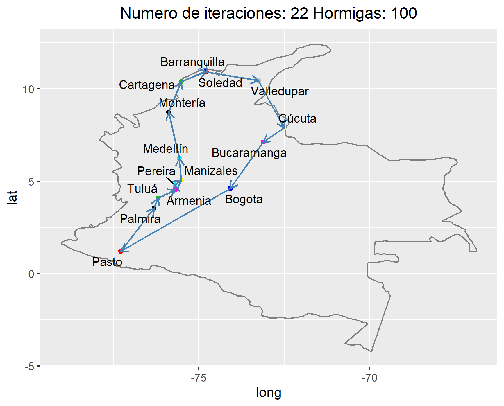

```{r setup, include=FALSE}
library(plotly)
library(DEoptim)
library(GA)
library(foreach)
library(iterators)
library(pso)
library(knitr)

knitr::opts_chunk$set(echo = TRUE)
```

## Planteamiento del problema 

### Optimizacion de funciones de prueba

Los métodos de optimizacion heuristica son alternativas a los metodos basados en el gradiente. Algunos, como los algoritmos evolutivos y las coloinas de hormicas, se inspiran en paradigmas de la biologia.

El objetivo de este trabajo es la aplicacion de metodos heuristicos.

#### Optimizacion de funciones de prueba

#### Funciones de prueba

Considere las siguientes funciones de prueba:

+ Función de Rosenbrock: $f(x_1, x_2) = 100(x_1-x_2^2)+(1-x_1)^2, 2_i \in [-2.048,2.048]$, $i?1,2$. Alcanza su valor minimo en $x_1 = 1$ y $x_2 = 1$.
+ Función de Rastrigin: $f(x1,x2)= 20 + ∑_{i=1}^2 x_i^2 − 10cos(2\pi x_i) , x_i∈[−5.12,5.12]$, $i=1,2$. Alcanza su valor minimo en $x_1 = 0$ y $x_2 = 0$.
+ Función de Schwefel: $f(x1,x2) = -∑_{i=1}^2 x_i sin(\sqrt{|xi|}), xi∈[−500,500]$, $i=1,2$. Alcanza su valor mínimo en $x1=420.9687$ y $x2=420.9687$.
+ Función de Griewank: $f(x1,x2)=∑_{i=1}^2 \frac{x_i^2}{4000} − ∏_{i=1}^2 cos(\frac{x_i}{\sqrt{i}}) +1, xi∈[−600,600]$, $i=1,2$.
Alcanza su valor mínimo en $x1=0$ y $x2=0$.
+ Función Goldstein-Price: $f(x_1,x_2)=[1+(x_1+x_2+1)^2(19−14x_1+3x_1^2−14x_2+6x_1x_2+3x_2^2)]$ $×[30+(2x_1−3x_2)^2(18−32x_1+12x_1^2+48x_2−36x_1x_2+27x_2^2)]$, $x_i∈[−2,2]$, $i=1,2$. Alcanza su valor mínimo en $x_1=0$ y $x_2=−1$.

+ Funcion de las seis jorobas de cabello *(six-humpcamel back)*: $f(x1,x2)=(4−2.1x_1^2+x_1^{4/3})x_1^2+x_1x_2+(−4+4x_2^2)x_2^2$, $x_1∈[−3,3]$ y $x_2∈[−2,2]$. Alcanza su valor mínimo en $x_1=−0.0898$ y $x_2=0.7126$ y también en $x_1=0.0898$ y $x_2=0.7126$.

#### Optimización

1. Escoja dos funciones de prueba

2. Optimice las funciones en dos y tres dimensiones usando un metodo de descenso por gradiente con condicion inicial aleatoria

3. Optimice las funciones en dos y tres dimnensiones usando: algoritmos evolutivos, optimizacion de particulas y evolucion diferencial

4. Represente con un gif animado o un video el proceso de optimizacion de descenso por gradiente y el proceso usando el metodo heuristico.


### El problema del vendedor viajero

Este este apartado se aplican metodos heuristicos para resolver el problema del vendedor viajero.

Un vendedor debe hacer un recorrido por las siguientes cuidades de colombia en su carro (no necesariamente en este orden):

+ Palmira
+ Pasto
+ Tulúa
+ Bogota
+ Pereira
+ Armenia
+ Caldas
+ Valledupar
+ Montería
+ Soledad
+ Cartagena
+ Barranquilla
+ Medellín
+ Bucaramanga
+ Cúcuta

Utilice colonias de hormigas y algotirmos geneticos para encontrar el orden optimo. El costo de desplazamiento entre ciudades es la suma del valor de la hora del vendedor (es un parámetro que debe estudiarse), el costo de los peajes y el costo del combustible. CAada equipo debe definir que carro hace el recorrido del vendedor y de allí extraer el costo del combustible.

Adicionalmente represente con un gif animado o un video cómo se comporta la mejor solución usando un grafico del recorrido del mapa de colombia.

## Resultados

### Optimización heurística

#### 1.Como primer funcion de prueba se escogio la funcion de rastrigin definida a continuacion:

Función de Rastrigin: $f(x1,x2)= 20 + ∑_{i=1}^2 x_i^2 − 10cos(2\pi x_i) , x_i∈[−5.12,5.12]$, $i=1,2$. Alcanza su valor minimo en $x_1 = 0$ y $x_2 = 0$.

```{r, include=TRUE}
# Determinamos la función de rastrigin a utilizar para graficar:
f_rastrigin2d<- function(x1,x2){
  y <- 20+x1^2-10*cos(2*pi*x1)+x2^2-10*cos(2*pi*x2)
  return(y)
}

n<-50
x1 <- seq(-5.12,5.12,length.out=n)
x2 <- seq(-5.12,5.12,length.out=n)

X <- expand.grid(x1,x2)
z <- f_rastrigin2d(X[,1],X[,2])
Z <- matrix(z,ncol=n,nrow=n)
```

Curvas de nivel de la función de Rastrigin

```{r, include=TRUE, fig.align="center"}
#Curvas de nivel:
contour(x1,x2,Z,
        main = "Función de Rastrigin",
        sub = "Curvas de nivel de la función")
filled.contour(x1, x2, Z,
               main = "Función de Rastrigin",
              color.palette = bl2gr.colors)
```

```{r, include=TRUE, fig.align="center"}
#persp(x1,x2,Z,theta = 50, d=2)
#persp3D(x1,x2,Z,theta = 50, phi = 20, col.palette = bl2gr.colors)

fig <- plot_ly(z = as.matrix(Z), type = "surface")
fig <- fig %>% add_surface()
fig
```

Definimos la funcion vectorizada 

```{r,include=TRUE}
# Rastrigin  vectorizada: para optimizar
f_rastrigin2d_vec <- function(x){
  x1 <- x[1]
  x2 <- x[2]
  y <- 20+x1^2-10*cos(2*pi*x1)+x2^2-10*cos(2*pi*x2)
  return(y)
} 
```

**Optimizamos la funcion con evolucion diferencial, para ello utiliamos la funcion <code> DEoptim </code>**

```{r, echo=TRUE}
# Optimizacion con evolución diferencial:
opt_ras01 <- DEoptim(fn=f_rastrigin2d_vec, lower=c(-5.12,-5.12), upper = c(5.12,5.12))

```

Curvas de nivel de la funcion optimizada

```{r, echo=TRUE, fig.align="center"}
contour(x1,x2,Z,
        main = "Función de Rastrigin",
        sub = "Curvas de nivel de la función")
lines(opt_ras01$member$pop,type="p",pch=2,col="red",lwd=3)
```

**Optimizamos con algoritmos geneticos utilizando la funcion <code>ga</code>**

```{r, echo=TRUE}
# Modifiquemos la función de Rastrigin para minimizarla usando un método de maximización:
f_rastrigin2d_vec_inv <- function(x){
  x1 <- x[1]
  x2 <- x[2]
  y <- 20+x1^2-10*cos(2*pi*x1)+x2^2-10*cos(2*pi*x2)
  return(-y)
}

opt_ras03 <- ga(type="real-valued", fitness = f_rastrigin2d_vec_inv, lower=c(-5.12,-5.12), upper = c(5.12,5.12), seed=5)
```

Resultados de la optimizacion

```{r, echo=FALSE}
summary(opt_ras03)
mejor_poblacion <- cbind(opt_ras03@population,opt_ras03@fitness)
```

Curvas de nivel

```{r, echo=FALSE, fig.align="center"}
contour(x1,x2,Z,
        main = "Función de Rastrigin",
        sub = "Curvas de nivel de la función")
lines(opt_ras03@population,type="p",pch=2,col="red",lwd=3)
```

En la siguiente grafica vemos  cómo el promedio, la mediana y el mejor valor de la función objetivo (el fitness) evoluciona en cada iteración repecto a la población vigente en la iteración

```{r, echo=FALSE, fig.align="center"}
#veamos cómo el promedio, la mediana y el mejor valor de la función objetivo (el fitness) 
#evoluciona en cada iteración repecto a la población vigente en la iteración
plot(opt_ras03)

optimArgs = list(control = list(trace = 1))
```

**Optimizamos por particulas utilizando la funcion <code>psoptim</code>**

```{r, echo=TRUE}
opt_ras_pso <- psoptim(par=c(NA,NA), fn=f_rastrigin2d_vec, lower=c(-5.12,-5.12),
                             upper = c(5.12,5.12), control = list(trace.stats=TRUE,trace=1))
```

Curvas de nivel

```{r, echo=FALSE, fig.align="center"}
#par(pty="s", mfrow=c(1,1))
contour(x1,x2,Z,main = "Función de Rastrigin",
        sub = "Distribucion Inicial")
lines(t(opt_ras_pso$stats$x[[1]]), type="p", pch=2,col="red",lwd=3)
#Ir cambiando el x[[1]] para ver cómo se comporta

#par(pty="s", mfrow=c(1,2))
contour(x1,x2,Z,main = "Función de Rastrigin",
        sub = "Distribucion Final")
lines(t(opt_ras_pso$stats$x[[100]]), type="p", pch=2,col="red",lwd=3)
```

**Optimizamos por gradiente multivariado**

```{r, echo=TRUE}
# Calculamos la derivada parcial
partial_dev <- function(x,i,fun,h=0.01){
  e <- x*0 # crea un vector de ceros de la misma longitud de x
  e[i] <- h
  y <- (fun(x+e)-fun(x-e))/(2*h)
  return(y)
}

# Obtenemos cada una de las derivadas parciales de f en x:
num_grad <- function(x,fun,h=0.01){
  # x: punto del espacio donde se debe evaluar el gradiente
  # fun: función para la que se desea calcular el gradiente en x
  # h: es el tamaño de ventana para el cálculo de la derivada numérica
  d <- length(x)
  y <- mapply(FUN=partial_dev,i=1:d,MoreArgs=list(x=x,h=h,fun=fun))
  return(y)
}
```

Sin precondicinamiento:

```{r, echo=TRUE}
# SIN PRECONDICIONAMIENTO:
#determinamos la función para evaluar el gradiente de la función Rastrigin:

deriv_grad <- function(x,fun,i=1,h=0.01){
  # x: punto en el que se evalúa el gradiente
  # fun: función para la cual se calcula la derivada del gradiente respecto a la íesima componente
  # i: i-ésima componente del vector x con respecto a la que se deriva
  e <- x*0 # crea un vector de ceros de la misma longitud de x
  e[i] <- h
  y <- (num_grad(x+e,fun=fun,h=h)-num_grad(x-e,fun=fun,h=h))/(2*h)
  return(y)
}

# Calculamos la matriz hessiana:
matriz_hessiana <- function(x,fun,h=0.01){
  # x: punto en el que se evalúa la matriz hessiana
  # fun: función a la que se le calcula la matriz hessiana en x
  # h: es el tamaño de ventana para el cálculo de la derivada numérica
  d <- length(x)
  y <- mapply(FUN=deriv_grad,i=1:d,MoreArgs=list(x=x,h=h,fun=fun),SIMPLIFY = TRUE)
  return(y)
}


# Determinamos la función de optimizador multivariado
optimizador_mult_numdev <- function(x0,fun,max_eval=100,h=0.01,eta=0.01){
  x <- matrix(NA,ncol =length(x0), nrow = max_eval)
  x[1,] <- x0
  for (i in 2:max_eval){
    num_grad_fun <- num_grad(x[i-1,],fun,h)
    H <- matriz_hessiana(x[i-1,],fun,h)
    cambio <- - eta*solve(H)%*%num_grad_fun
    x[i,] <- x[i-1,] + cambio
    cambio_opt <- sqrt(sum((x[i-1,]-x[i,])^2))
    if (cambio_opt<0.00001){
      break
    }
  }
  return(x[1:i,])
}

#pasamos rastrigin al optimizador iniciando desde (0.8,4.8)
sol_ras <- optimizador_mult_numdev(f_rastrigin2d_vec,x0=c(0.8,4.8),eta=1)
```

Curvas de nivel

```{r, echo=TRUE,  fig.align="center"}
contour(x1, x2, Z, las=1,
        xlab = expression(x[1]), ylab = expression(x[2]),
        main = "Función de Rastrigin",
        sub = "Curvas de nivel de la función")
lines(sol_ras, type="b",cex=1.5,col="red")
```

Con preacondicionamiento:

```{r, echo=TRUE}
#CON PRECONDICIONAMIENTO
#hacemos el precondicionamiento para la cantidad de dimensiones
deriv_segunda <- function(x,fun,i=1,h=0.01){
  e <- x*0 # crea un vector de ceros de la misma longitud de x
  e[i] <- h
  y <- (fun(x+e)-2*fun(x)+fun(x-e))/(h^2)
  return(y)
}

# Determinamos la función de optimizador multivariado
optimizador_mult_precond <- function(x0,fun,max_eval=100,h=0.01,eta=0.01){
  x <- matrix(NA,ncol =length(x0), nrow = max_eval)
  d <- length(x0)
  x[1,] <- x0
  for (i in 2:max_eval){
    num_grad_fun <- num_grad(x[i-1,],fun,h)
    diag_H <- mapply(FUN=deriv_segunda,i=1:d,MoreArgs=list(x=x[i-1,],h=h,fun=fun))
    # print(diag_H)
    # H <- matriz_hessiana(x[i-1,],fun,h)
    # print(H)
    H_precond <- diag(1/diag_H)
    cambio <- - eta*H_precond%*%num_grad_fun
    x[i,] <- x[i-1,] + cambio
    cambio_opt <- sqrt(sum((x[i-1,]-x[i,])^2))
    if (cambio_opt<0.0000001){
      break
    }
  }
  return(x[1:i,])
}

#pasamos rastrigin al optimizador iniciando desde (0.8,4.8)
sol_ras_precon <- optimizador_mult_precond(f_rastrigin2d_vec,x0=c(0.8,4.8),eta=1)
```

Curvas de nivel

```{r, echo=TRUE,  fig.align="center"}
contour(x1, x2, Z, las=1,
        xlab = expression(x[1]), ylab = expression(x[2]),
        main = "Función de Rastrigin",
        sub = "Curvas de nivel de la función")
lines(sol_ras_precon, type="b",cex=1.5,col="red")
lines(sol_ras, type="b",cex=1.5,col="blue")
legend("topleft",col=c("red","blue"),legend = c("Con precondicionamiento","Sin precondicionamiento"),lty=1)
```

#### 2.Como segunda funcion de prueba se escogio la funcion de Schwefel definida a continuacion:

Función de Schwefel: $f(x1,x2) = -∑_{i=1}^2 x_i sin(\sqrt{|xi|}), xi∈[−500,500]$, $i=1,2$. Alcanza su valor mínimo en $x1=420.9687$ y $x2=420.9687$.

```{r, include=TRUE}
#determinamos la función de schwefel a utilizar para graficar:
f_schwefel2d<- function(x1,x2){
  y <- (-((x1*sin(sqrt(abs(x1)))) + (x2*sin(sqrt(abs(x2)))) ))
  return(y)
}

n<-50
x1 <- seq(-500,500,length.out=n)
x2 <- seq(-500,500,length.out=n)

X <- expand.grid(x1,x2)
z <- f_schwefel2d(X[,1],X[,2])
Z <- matrix(z,ncol=n,nrow=n)
```

Curvas de nivel de la función de Schwefel

```{r, include=TRUE, fig.align="center"}
#Curvas de nivel:
contour(x1,x2,Z)
filled.contour(x1, x2, Z, color.palette = bl2gr.colors)
#persp(x1,x2,Z,theta = 50, d=2)
```

```{r, include=TRUE, fig.align="center"}
#la persp3d Esta poniendo problema para graficar con colores
#persp3d(x1,x2,Z,theta = 50, phi = 20, col.palette = bl2gr.colors)
fig <- plot_ly(z = as.matrix(Z), type = "surface")
fig <- fig %>% add_surface()
fig
```

Definimos la funcion vectorizada 

```{r,include=TRUE}
#schwefel  vectorizada: para optimizar
f_schwefel2d_vec <- function(x){
  x1 <- x[1]
  x2 <- x[2]
  y <- (-((x1*sin(sqrt(abs(x1)))) + (x2*sin(sqrt(abs(x2))))))
  return(y)
} 
```

**Optimizamos la funcion con evolucion diferencial, para ello utiliamos la funcion <code> DEoptim </code>**

```{r, echo=TRUE}
# Optimizacion con evolución diferencial:
opt_schwefel_DE <- DEoptim(fn=f_schwefel2d_vec, lower=c(-500,-500), upper = c(500,500))

```

Curvas de nivel de la funcion optimizada

```{r, echo=TRUE, fig.align="center"}
contour(x1,x2,Z,
        main = "Función de Schwefel",
        sub = "Curvas de nivel de la función")
lines(opt_schwefel_DE$member$pop,type="p",pch=2,col="red",lwd=3)
```

**Optimizamos con algoritmos geneticos utilizando la funcion <code>ga</code>**

```{r, echo=TRUE}
#Modificamos la función de Schwefel para minimizarla usando un método de maximización:
f_schwefel2d_vec_inv <- function(x){
  x1 <- x[1]
  x2 <- x[2]
  y <- (-((x1*sin(sqrt(abs(x1)))) + (x2*sin(sqrt(abs(x2)))) ))
  return(-y)
}

opt_schwefel_GA <- ga(type="real-valued", fitness = f_schwefel2d_vec_inv, lower=c(-500,-500), upper = c(500,500), seed=5)
```

Resultados de la optimizacion

```{r, echo=FALSE}
summary(opt_schwefel_GA)
mejor_poblacion <- cbind(opt_schwefel_GA@population,opt_schwefel_GA@fitness)
```

Curvas de nivel

```{r, echo=FALSE, fig.align="center"}
contour(x1,x2,Z,
        main = "Función de Schwefel",
        sub = "Curvas de nivel de la función")
lines(opt_schwefel_GA@population,type="p",pch=2,col="red",lwd=3)
```

En la siguiente grafica vemos  cómo el promedio, la mediana y el mejor valor de la función objetivo (el fitness) evoluciona en cada iteración repecto a la población vigente en la iteración

```{r, echo=FALSE, fig.align="center"}
#veamos cómo el promedio, la mediana y el mejor valor de la función objetivo (el fitness) 
#evoluciona en cada iteración repecto a la población vigente en la iteración
plot(opt_schwefel_GA)

optimArgs = list(control = list(trace = 1))
```

**Optimizamos por particulas utilizando la funcion <code>psoptim</code>**

```{r, echo=TRUE}
opt_schwefel_pso <- psoptim(par=c(NA,NA), fn=f_schwefel2d_vec, lower=c(-500,-500),
                            upper = c(500,500), control = list(trace.stats=TRUE,trace=1))
```

Curvas de nivel

```{r, echo=FALSE, fig.align="center"}
contour(x1,x2,Z,main = "Función de Schwefel",
        sub = "Distribucion Inicial")
lines(t(opt_schwefel_pso$stats$x[[1]]), type="p", pch=2,col="red",lwd=3)

contour(x1,x2,Z,main = "Función de Schwefel",
        sub = "Distribucion Final")
lines(t(opt_schwefel_pso$stats$x[[100]]), type="p", pch=2,col="red",lwd=3)
```

**Optimizamos por gradiente multivariado**

```{r, echo=TRUE}
# Calculamos la derivada parcial
partial_dev <- function(x,i,fun,h=0.01){
  e <- x*0 # crea un vector de ceros de la misma longitud de x
  e[i] <- h
  y <- (fun(x+e)-fun(x-e))/(2*h)
  return(y)
}

# Obtenemos cada una de las derivadas parciales de f en x:
num_grad <- function(x,fun,h=0.01){
  # x: punto del espacio donde se debe evaluar el gradiente
  # fun: función para la que se desea calcular el gradiente en x
  # h: es el tamaño de ventana para el cálculo de la derivada numérica
  d <- length(x)
  y <- mapply(FUN=partial_dev,i=1:d,MoreArgs=list(x=x,h=h,fun=fun))
  return(y)
}
```

Sin precondicinamiento:

```{r, echo=TRUE}
#pasamos schwefel al optimizador SIN precondicionamiento iniciando desde (380,390)
sol_schwefel <- optimizador_mult_numdev(f_schwefel2d_vec,x0=c(380,390),eta=1)
```

Curvas de nivel

```{r, echo=TRUE,  fig.align="center"}
contour(x1, x2, Z, las=1,
        xlab = expression(x[1]), ylab = expression(x[2]),
        main = "Función de Schwefel",
        sub = "Curvas de nivel de la función")
lines(sol_schwefel, type="b",cex=1.5,col="red")
```

Con preacondicionamiento:

```{r, echo=TRUE}
#pasamos schwefel al optimizador CON precondicionamiento iniciando desde (380,390)
sol_schwefel_precon <- optimizador_mult_precond(f_schwefel2d_vec,x0=c(380,390),eta=1)
```

Curvas de nivel

```{r, echo=TRUE,  fig.align="center"}
contour(x1, x2, Z, las=1,
        xlab = expression(x[1]), ylab = expression(x[2]),
        main = "Función de Schwefel",
        sub = "Curvas de nivel de la función")
lines(sol_schwefel_precon, type="b",cex=1.5,col="red")
lines(sol_schwefel, type="b",cex=1.5,col="blue")
legend("topleft",col=c("red","blue"),legend = c("Con precondicionamiento","Sin precondicionamiento"),lty=1)
```


### El problema del vendedor viajero

Para llevar acabo el desarrollo del problema del vendedor viajero primero tuvimos que crear la matriz de costos a partir de otras matrices. Obtuvimos la matriz *"costos entre trayectos-peajes"*, *"kilometros entre ciudades"* y *"tiempo estimado entre ciudades en minutos"*, como dos de estas matrices no estaban expresadas en terminos de costos, se multiplicaron por constantes como el *sueldo por hora del vendedor*, *el precio de la gasolina por galon* y el *rendimiento de vehiculo*, en este caso un *Renault Sandero* .

+ Sueldo basico del vendedor  **$10.417 pesos/hora**
+ Precio del combustible **$8.525 /Galon**
+ Rendimiento del vehiculo **50 km/Galon**

Dando como resultado la siguiente matriz de costos:

```{r,echo=FALSE}
# Leemos la matrix de costos
D <- read.csv("costos_ciudades2.csv", sep = ";", row.name = 1)
#kable(D)
D
```

Luego de obtener esta matriz procedemos a resolver el problema utilizando los dos metodos solicitados.

#### Algoritmos Geneticos (GA)

A continuacion presentamos el codigo utilizado para resolver el problema del vendedor viajero utilizando algoritmos geneticos, ademas incluye directamente el guardado de la grafica de cada resultado y genera un gif utilizando todas las graficas. 

```{r,eval = FALSE}

## Importamos las librerias que vamos a usar
library(GA)
library(tidyverse)
library(animation)
library(ggrepel)

# Creamos la matrix de coordenadas para las graficas
ciudades <- c("Palmira",	"Pasto",	"Tuluá",	"Bogota",	"Pereira",	"Armenia",	"Manizales",	"Valledupar",	"Montería",	"Soledad",
              "Cartagena",	"Barranquilla",	"Medellín",	"Bucaramanga",	"Cúcuta")
coordenadas <- data.frame( long = c(-76.30361, -77.28111, -76.19536, -74.08175, -75.69611, -75.68111, -75.51738, -73.25322, -75.88143, -74.76459,
                                    -75.51444, -74.78132, -75.56359, -73.1198, -72.50782),
                           lat= c(3.53944, 1.21361, 4.08466, 4.60971, 4.81333, 4.53389, 5.06889, 10.46314, 8.74798, 10.91843,
                                  10.39972, 10.96854, 6.25184, 7.12539, 7.89391),
                           stringsAsFactors = F)

# Leemos la matrix de costos
D <- read.csv("costos_ciudades2.csv", sep = ";", row.name = 1)

#Funcion para calcular la longitud del tour
tourLength <- function(tour, distMatrix) {
  tour <- c(tour, tour[1])
  route <- embed(tour, 2)[,2:1]
  sum(distMatrix[route])
}

#Fitness function to be maximized
tspFitness <- function(tour, ...) 1/tourLength(tour, ...)

# Iteracciones maximas
Maxter <- c(25, 50, 75, 100, 200, 400, 600, 800, 1000,  1200)

# Ciudades
x <- coordenadas[,1]
y <- coordenadas[,2]

# Utilizamos la funcion saveGIF para crear el gif durante la iteraccion de la funcion de
# GA, es decir, durante cada entranamiento guardamos cada resultado en forma de grafica
# y por ultimos entregamos el GIF.
saveGIF(
  
  # For para cambiar el numero maximo de iteraciones en la funcion GA
  for (i in 1:length(Maxter)) {
    set.seed(124)

    GAiter <- ga(type = "permutation", fitness = tspFitness, distMatrix = D,
                 lower = 1, upper = 15, popSize = 50, maxiter = Maxter[i],
                 run = 500, pmutation = 0.2)

    tour <- GAiter@solution[1, ]
    tour <- c(tour, tour[1])
    n <- length(tour)

    ## Grafica
    map <- ggplot() +
      borders("world", "colombia") +
      geom_point(data = coordenadas,
                 aes(x = long,
                     y = lat), colour = c(1,2,3,4,5,6,7,8,9,10,11,12,13,14,15))

    map_vectors <- map +
      ggtitle(paste( paste("Max. numero de iteraciones:", Maxter[i]), paste(" - Iteracciones realizadas: ", GAiter@iter))) +
      theme(plot.title = element_text(hjust = 0.5)) +
      geom_segment(aes(x = x[tour[-n]], y = y[tour[-n]], xend = x[tour[-1]], yend = y[tour[-1]]),
                   arrow = arrow(length = unit(0.25, "cm")), col = "steelblue", lwd= 0.6) +
      geom_text_repel(aes(x, y, label = ciudades),
                      size = 3.5)
    plot(map_vectors)

    # Guardamos las imagenes para el GIF
    ggsave(map_vectors, filename = gsub(" ", "", paste("Ga_", i,".png")),  width = 5.78 , height = 4.66)

  }
  , movie.name = "TSP_GA.gif")
```

A continuacion podremos obervar la primer grafica obtenida con el algoritmo genetico.

```{r ,fig.align = 'center',  out.width = '50%', echo=FALSE}
include_graphics("Ga_1.png",)
```

En esta grafica observamos que la ruta que siguio el algoritmo fue la siguiente:

```{r,echo = FALSE}
#Peor resultado GA
PGA <- c(11,  10, 9,  5,  6,  3,  1,  2,  7, 4, 13,  14,   8,  15,  12)
PCitys <- c("Cartagena","Soledad","Montería",  "Pereira","Armenia", "Tuluá","Palmira","Pasto",
           "Manizales","Bogota","Medellín","Bucaramanga","Valledupar",
             "Cúcuta", "Barranquilla")
Datos_P <- data.frame(PGA, PCitys)
Datos_P
```

Dando como resultado un costo de:

```{r,echo = FALSE}
Costo_P <- 2667694  
Costo_P
```

La siguiente es la ultima grafica donde podremos detallar que a pesar de tener un maximo de 1200 iteracion el algoritmo encontro la mejor ruta en tan solo 1044 iteraciones.


```{r ,fig.align = 'center', out.width = '50%', echo=FALSE}
include_graphics("Ga_10.png",)
```

En esta grafica observamos que la ruta que siguio el algoritmo fue la siguiente:

```{r,echo = FALSE}
#Mejor resultado GA
BGA <- c(11,  9, 13,  7,  5,  6,  3,  1,  2, 4, 14,  15,   8,  10,  12)
Citys <- c("Cartagena", "Montería", "Medellín","Manizales", "Pereira","Armenia", "Tuluá", "Palmira","Pasto","Bogota","Bucaramanga","Cúcuta","Valledupar",
           "Soledad","Barranquilla")
Datos <- data.frame(BGA, Citys)
Datos
```

Dando como resultado un costo de:

```{r,echo = FALSE}
Costos_B <- 2044516 
Costos_B
```

Por ultimo, presentamos el gif en el cual observaremos las variaciones que el algoritmo presenta cuando varian el numero maximo de iteracciones posibles.

```{r ,fig.align = 'center', fig.height= 1, fig.width= 1, echo=FALSE}
include_graphics("TSP_GA.gif",)
```

#### Colonia de Hormigas

Para este punto se llevo a acabo el desarrollo de la solucion en <code>Python</code> dado que para este lenguaje se presentaban una mayor cantidad de librerias disponibles, haciendo mas simple la implementacion del algoritmo y solucion del problema.

```{r,eval = FALSE}
#Repo: https://github.com/johnberroa/Ant-Colony-Optimization
import pandas as pd
import numpy as np
import matplotlib.pyplot as plt
import time
import warnings

from pandas.core.frame import DataFrame
warnings.filterwarnings("ignore")

class AntColonyOptimizer:
    def __init__(self, ants, evaporation_rate, intensification, alpha=1.0, beta=0.0, beta_evaporation_rate=0,
                 choose_best=.1):
        """
        Ant colony optimizer.  Traverses a graph and finds either the max or min distance between nodes.
        :param ants: number of ants to traverse the graph
        :param evaporation_rate: rate at which pheromone evaporates
        :param intensification: constant added to the best path
        :param alpha: weighting of pheromone
        :param beta: weighting of heuristic (1/distance)
        :param beta_evaporation_rate: rate at which beta decays (optional)
        :param choose_best: probability to choose the best route
        """
        # Parameters
        self.ants = ants
        self.evaporation_rate = evaporation_rate
        self.pheromone_intensification = intensification
        self.heuristic_alpha = alpha
        self.heuristic_beta = beta
        self.beta_evaporation_rate = beta_evaporation_rate
        self.choose_best = choose_best

        # Internal representations
        self.pheromone_matrix = None
        self.heuristic_matrix = None
        self.probability_matrix = None

        self.map = None
        self.set_of_available_nodes = None

        # Internal stats
        self.best_series = []
        self.best = None
        self.fitted = False
        self.best_path = None
        self.fit_time = None

        # Plotting values
        self.stopped_early = False

    def __str__(self):
        string = "Ant Colony Optimizer"
        string += "\n--------------------"
        string += "\nDesigned to optimize either the minimum or maximum distance between nodes in a square matrix that behaves like a distance matrix."
        string += "\n--------------------"
        string += "\nNumber of ants:\t\t\t\t{}".format(self.ants)
        string += "\nEvaporation rate:\t\t\t{}".format(self.evaporation_rate)
        string += "\nIntensification factor:\t\t{}".format(self.pheromone_intensification)
        string += "\nAlpha Heuristic:\t\t\t{}".format(self.heuristic_alpha)
        string += "\nBeta Heuristic:\t\t\t\t{}".format(self.heuristic_beta)
        string += "\nBeta Evaporation Rate:\t\t{}".format(self.beta_evaporation_rate)
        string += "\nChoose Best Percentage:\t\t{}".format(self.choose_best)
        string += "\n--------------------"
        string += "\nUSAGE:"
        string += "\nNumber of ants influences how many paths are explored each iteration."
        string += "\nThe alpha and beta heuristics affect how much influence the pheromones or the distance heuristic weigh an ants' decisions."
        string += "\nBeta evaporation reduces the influence of the heuristic over time."
        string += "\nChoose best is a percentage of how often an ant will choose the best route over probabilistically choosing a route based on pheromones."
        string += "\n--------------------"
        if self.fitted:
            string += "\n\nThis optimizer has been fitted."
        else:
            string += "\n\nThis optimizer has NOT been fitted."
        return string

    def _initialize(self):
        """
        Initializes the model by creating the various matrices and generating the list of available nodes
        """
        assert self.map.shape[0] == self.map.shape[1], "Map is not a distance matrix!"
        num_nodes = self.map.shape[0]
        self.pheromone_matrix = np.ones((num_nodes, num_nodes))
        # Remove the diagonal since there is no pheromone from node i to itself
        self.pheromone_matrix[np.eye(num_nodes) == 1] = 0
        self.heuristic_matrix = 1 / self.map
        self.probability_matrix = (self.pheromone_matrix ** self.heuristic_alpha) * (
                self.heuristic_matrix ** self.heuristic_beta)  # element by element multiplcation
        self.set_of_available_nodes = list(range(num_nodes))

    def _reinstate_nodes(self):
        """
        Resets available nodes to all nodes for the next iteration
        """
        self.set_of_available_nodes = list(range(self.map.shape[0]))

    def _update_probabilities(self):
        """
        After evaporation and intensification, the probability matrix needs to be updated.  This function
        does that.
        """
        self.probability_matrix = (self.pheromone_matrix ** self.heuristic_alpha) * (
                self.heuristic_matrix ** self.heuristic_beta)

    def _choose_next_node(self, from_node):
        """
        Chooses the next node based on probabilities.  If p < p_choose_best, then the best path is chosen, otherwise
        it is selected from a probability distribution weighted by the pheromone.
        :param from_node: the node the ant is coming from
        :return: index of the node the ant is going to
        """
        numerator = self.probability_matrix[from_node, self.set_of_available_nodes]
        if np.random.random() < self.choose_best:
            next_node = np.argmax(numerator)
        else:
            denominator = np.sum(numerator)
            probabilities = numerator / denominator
            next_node = np.random.choice(range(len(probabilities)), p=probabilities)
        return next_node

    def _remove_node(self, node):
        self.set_of_available_nodes.remove(node)

    def _evaluate(self, paths, mode):
        """
        Evaluates the solutions of the ants by adding up the distances between nodes.
        :param paths: solutions from the ants
        :param mode: max or min
        :return: x and y coordinates of the best path as a tuple, the best path, and the best score
        """
        scores = np.zeros(len(paths))
        coordinates_i = []
        coordinates_j = []
        for index, path in enumerate(paths):
            score = 0
            coords_i = []
            coords_j = []
            for i in range(len(path) - 1):
                coords_i.append(path[i])
                coords_j.append(path[i + 1])
                score += self.map[path[i], path[i + 1]]
            scores[index] = score
            coordinates_i.append(coords_i)
            coordinates_j.append(coords_j)
        if mode == 'min':
            best = np.argmin(scores)
        elif mode == 'max':
            best = np.argmax(scores)
        return (coordinates_i[best], coordinates_j[best]), paths[best], scores[best]

    def _evaporation(self):
        """
        Evaporate some pheromone as the inverse of the evaporation rate.  Also evaporates beta if desired.
        """
        self.pheromone_matrix *= (1 - self.evaporation_rate)
        self.heuristic_beta *= (1 - self.beta_evaporation_rate)

    def _intensify(self, best_coords):
        """
        Increases the pheromone by some scalar for the best route.
        :param best_coords: x and y (i and j) coordinates of the best route
        """
        i = best_coords[0]
        j = best_coords[1]
        self.pheromone_matrix[i, j] += self.pheromone_intensification

    def fit(self, map_matrix, iterations=100, mode='min', early_stopping_count=20, verbose=True):
        """
        Fits the ACO to a specific map.  This was designed with the Traveling Salesman problem in mind.
        :param map_matrix: Distance matrix or some other matrix with similar properties
        :param iterations: number of iterations
        :param mode: whether to get the minimum path or maximum path
        :param early_stopping_count: how many iterations of the same score to make the algorithm stop early
        :return: the best score
        """
        if verbose: print("Beginning ACO Optimization with {} iterations...".format(iterations))
        self.map = map_matrix
        start = time.time()
        self._initialize()
        num_equal = 0

        for i in range(iterations):
            start_iter = time.time()
            paths = []
            path = []

            for ant in range(self.ants):
                current_node = self.set_of_available_nodes[np.random.randint(0, len(self.set_of_available_nodes))]
                start_node = current_node
                while True:
                    path.append(current_node)
                    self._remove_node(current_node)
                    if len(self.set_of_available_nodes) != 0:
                        current_node_index = self._choose_next_node(current_node)
                        current_node = self.set_of_available_nodes[current_node_index]
                    else:
                        break

                path.append(start_node)  # go back to start
                self._reinstate_nodes()
                paths.append(path)
                path = []

            best_path_coords, best_path, best_score = self._evaluate(paths, mode)

            if i == 0:
                best_score_so_far = best_score
            else:
                if mode == 'min':
                    if best_score < best_score_so_far:
                        best_score_so_far = best_score
                        self.best_path = best_path
                elif mode == 'max':
                    if best_score > best_score_so_far:
                        best_score_so_far = best_score
                        self.best_path = best_path

            if best_score == best_score_so_far:
                num_equal += 1
            else:
                num_equal = 0

            self.best_series.append(best_score)
            self._evaporation()
            self._intensify(best_path_coords)
            self._update_probabilities()

            if verbose: print("Best score at iteration {}: {}; overall: {} ({}s)"
                              "".format(i, round(best_score, 2), round(best_score_so_far, 2),
                                        round(time.time() - start_iter)))

            if best_score == best_score_so_far and num_equal == early_stopping_count:
                self.stopped_early = True
                print("Stopping early due to {} iterations of the same score.".format(early_stopping_count))
                break

        self.fit_time = round(time.time() - start)
        self.fitted = True

        if mode == 'min':
            self.best = self.best_series[np.argmin(self.best_series)]
            if verbose: print(
                "ACO fitted.  Runtime: {} minutes.  Best score: {}".format(self.fit_time // 60, self.best))
            return self.best
        elif mode == 'max':
            self.best = self.best_series[np.argmax(self.best_series)]
            if verbose: print(
                "ACO fitted.  Runtime: {} minutes.  Best score: {}".format(self.fit_time // 60, self.best))
            return self.best
        else:
            raise ValueError("Invalid mode!  Choose 'min' or 'max'.")

    def plot(self):
        """
        Plots the score over time after the model has been fitted.
        :return: None if the model isn't fitted yet
        """
        if not self.fitted:
            print("Ant Colony Optimizer not fitted!  There exists nothing to plot.")
            return None
        else:
            fig, ax = plt.subplots(figsize=(20, 15))
            ax.plot(self.best_series, label="Best Run")
            ax.set_xlabel("Iteration")
            ax.set_ylabel("Performance")
            ax.text(.8, .6,
                    'Ants: {}\nEvap Rate: {}\nIntensify: {}\nAlpha: {}\nBeta: {}\nBeta Evap: {}\nChoose Best: {}\n\nFit Time: {}m{}'.format(
                        self.ants, self.evaporation_rate, self.pheromone_intensification, self.heuristic_alpha,
                        self.heuristic_beta, self.beta_evaporation_rate, self.choose_best, self.fit_time // 60,
                        ["\nStopped Early!" if self.stopped_early else ""][0]),
                    bbox={'facecolor': 'gray', 'alpha': 0.8, 'pad': 10}, transform=ax.transAxes)
            ax.legend()
            plt.title("Ant Colony Optimization Results (best: {})".format(np.round(self.best, 2)))
            plt.show()
#-------------------------------------------------------------------------------------------------------------

# Read the cost matrix
data = pd.read_csv('/home/joan/Escritorio/Ant_Colony_TSP/costos_ciudades.csv', sep=";", index_col=0)

# Change the dataframe to an array
data_matrix = data.to_numpy()

## CHANGE ANTS

# Create a dataframe to save iterations results
#best_pa = DataFrame(columns = ['Ants1','Ants15', 'Ants30', 'Ants45', 'Ants60', 'Ants75', 'Ants90','Ants105', 'Ants120', 'Ants135'])

# # Ants array                               
# Ants = [1, 15, 30, 45, 60, 75, 90, 105, 120, 135]

# for n in range(10):

#     # Create the Antiptimizer using differents parameteres
#     optimizer = AntColonyOptimizer(ants=Ants[n], evaporation_rate=.1, intensification=2, alpha=1, beta=1,
#                                    beta_evaporation_rate=0, choose_best=.1)

#     # Traing the model and save tha best result                             
#     optimizer.fit(data_matrix, 100, early_stopping_count = 20)
    
#     # Save the values in a dataframe
#     best_pa[best_pa.columns[n]] = optimizer.best_path

## CHANGE ITERATIONS

# Create a dataframe to save iterations results
#best_pa = DataFrame(columns = ['iter5','iter10', 'iter15', 'iter20', 'iter25', 'iter30', 'iter35', 'iter40', 'iter45', 'iter50'])
best_pa = DataFrame(columns = ['iter4','iter6', 'iter8', 'iter10', 'iter12', 'iter14', 'iter16', 'iter18', 'iter20', 'iter22'])

# Ants array                               
#Iter = [5, 10, 15, 20, 25, 30, 35, 40, 45, 50]
Iter = [4, 6, 8, 10, 12, 14, 16, 18, 20, 22]

for n in range(10):

    # Create the Antiptimizer using differents parameteres
    optimizer = AntColonyOptimizer(ants=100, evaporation_rate=.1, intensification=2, alpha=1, beta=1,
                                   beta_evaporation_rate=0, choose_best=.1)

    # Traing the model and save tha best result                             
    optimizer.fit(data_matrix, Iter[n])
    
    # Save the values in a dataframe
    best_pa[best_pa.columns[n]] = optimizer.best_path

## SAVE RESULTS

# Show the best tour in terminal
print("\nTours table results: \n")
print(best_pa)

# saving the dataframe in a csv
print("\n Saving results in tours_results.csv")
best_pa.to_csv('/home/joan/Escritorio/Ant_Colony_TSP/tours_results.csv')

```

Para graficar y obtener el gif utilizamos el mismo codigo implementado con en algoritmos geneticos, solo que esta vez iteramos sobre el archivo de salida que genera el codigo en python.

```{r,eval = FALSE}
## Usango colonia de hormigas

## Importamos las librerias que vamos a usar
#library(GA)
#library(tidyverse)
#library(animation)
#library(ggrepel)

# Creamos la matrix de coordenadas
#ciudades <- c("Palmira",	"Pasto",	"Tuluá",	"Bogota",	"Pereira",	"Armenia",	"Manizales",	"Valledupar",	"Montería",	"Soledad",
#              "Cartagena",	"Barranquilla",	"Medellín",	"Bucaramanga",	"Cúcuta")
#coordenadas <- data.frame( long = c(-76.30361, -77.28111, -76.19536, -74.08175, -75.69611, -75.68111, -75.51738, -73.25322, -75.88143, -74.76459,
#                                    -75.51444, -74.78132, -75.56359, -73.1198, -72.50782),
#                           lat= c(3.53944, 1.21361, 4.08466, 4.60971, 4.81333, 4.53389, 5.06889, 10.46314, 8.74798, 10.91843,
#                                  10.39972, 10.96854, 6.25184, 7.12539, 7.89391),
#                           stringsAsFactors = F)

# Leemos el archivo resultante luego de ejecutar el metodo de colonia de
# hormigas en python
Resultado_Ant <- read.csv("tours_results.csv", sep = ",", row.name = 1)
iter <- c(4,6,8,10,12,14,16,18,20,22)

# Ciudades
#x <- coordenadas[,1]
#y <- coordenadas[,2]

saveGIF(
  # For para cambiar los datos que vamos a graficar
  for (i in c(1,2,3,4,5,6,7,8,9,10)) {

    tour <- as.matrix(Resultado_Ant[i])
    tour <- tour + 1
    n <- length(tour)
    
    ## Grafica
    map <- ggplot() +
      borders("world", "colombia") +
      geom_point(data = coordenadas,
                 aes(x = long,
                     y = lat), colour = c(1,2,3,4,5,6,7,8,9,10,11,12,13,14,15))
    
    map_vectors <- map +
      ggtitle(paste( paste("Numero de iteraciones:", iter[i]), "Hormigas: 100")) +
      theme(plot.title = element_text(hjust = 0.5)) +
      geom_segment(aes(x = x[tour[-n]], y = y[tour[-n]], xend = x[tour[-1]], yend = y[tour[-1]]),
                   arrow = arrow(length = unit(0.25, "cm")), col = "steelblue", lwd= 0.6) +
      geom_text_repel(aes(x, y, label = ciudades),
                      size = 3.5)
    plot(map_vectors)
    
    # Guardamos las imagenes para el GIF
    ggsave(map_vectors, filename = gsub(" ", "", paste("Ants_", i,".png")),  width = 5.78 , height = 4.66)
    
  }
  , movie.name = "TSP_ANTS.gif")
```


A continuacion podremos obervar la primer grafica obtenida con el algoritmo de colonia de hormigas

```{r ,fig.align = 'center', out.width = '50%', echo=FALSE}
include_graphics("Ants_1.png",)
```

En esta grafica observamos que la ruta que siguio el algoritmo fue la siguiente:

```{r,echo = FALSE}
#Peor resultado Ants
PAN <- c(0, 2, 5, 4, 6, 12, 3, 13, 14, 9, 11, 10, 7, 8, 1)
PAN <- PAN + 1
PCitys <- c("Palmira", "Tuluá", "Armenia", "Pereira", "Manizales", "Medellín", "Bogota", "Bucaramanga", "Cúcuta", "Soledad", "Barranquilla", "Cartagena", "Valledupar", "Montería", "Pasto")

Datos_P <- data.frame(PAN, PCitys)
Datos_P
```

Dando como resultado un costo de:

```{r,echo = FALSE}
Costo_P <- 2413283 
Costo_P
```

La siguiente es la ultima grafica donde podremos observar un parecido con la ultima grafica del algoritmo genetico.

```{r ,fig.align = 'center', out.width = '50%', echo=FALSE}


```

En esta grafica observamos que la ruta que siguio el algoritmo fue la siguiente:

```{r,echo = FALSE}
#Mejor resultado Ants
#BAN <- c(11, 9, 7, 14, 13, 3, 1, 0, 2, 5, 4, 6, 12, 8, 10)
BAN <- c(11, 9, 7, 14, 13, 3, 1, 0, 2, 5, 4, 6, 12, 8, 10)
BAN <- BAN + 1
Citys <- c("Barranquilla", "Soledad", "Valledupar", "Cúcuta", "Bucaramanga", "Bogota", "Pasto", "Palmira", "Tuluá", "Armenia", "Pereira", "Manizales", "Medellín", "Montería", "Cartagena")

Datos <- data.frame(BAN, Citys)
Datos
```

Dando como resultado un costo de:

```{r,echo = FALSE}
Costo_B <-   2044516
Costo_B
```

Por ultimo, presentamos el gif en el cual observaremos las variaciones que el algoritmo presenta cuando varian el numero maximo de iteracciones posibles.

```{r ,fig.align = 'center', echo=FALSE}
include_graphics("TSP_ANTS.gif",)
```


Para concluir se puede observar que tanto en Algoritmos Geneticos como en Colonia de Hormigas el mejor costo obtenido para el problema del viajero vendedor fue de  **$2'044.516 pesos** ademas que el recorrido de las ciudades es el mismo , lo que demuestra que ambos algoritmos convergen en la misma solucion y que son muy efectivos para la resolucion de este tipo de problemas.


## Bibliografia

+ https://cran.r-project.org/web/packages/GA/vignettes/GA.html
+ https://baobabsoluciones.es/blog/2020/10/01/problema-del-viajante/#:~:text=El%20problema%20del%20viajante%20(por,a%20la%20ciudad%20de%20origen.
+ https://baobabsoluciones.es/blog/2019/12/04/algoritmo-aco/
+ https://www.r-orms.org/mixed-integer-linear-programming/practicals/problem-tsp/
+ https://www.google.com/maps/@15,-2.970703,3z?hl=es
+ https://www.waze.com/es/
+ https://www.viajaporcolombia.com/peajes
+ https://www.rome2rio.com/es/
+ https://baobabsoluciones.es/blog/2020/10/01/problema-del-viajante/
+ https://rpubs.com/karthy1988/TSP_GA
+ https://rpubs.com/somasdhavala/GAeg
h+ ttps://cran.r-project.org/web/packages/GA/vignettes/GA.html
+ https://stackoverflow.com/questions/38008863/how-to-draw-a-nice-arrow-in-ggplot2
+ https://github.com/ggsdc/tsp-solvers/blob/master/tsp_solvers/methods/ga.py
 